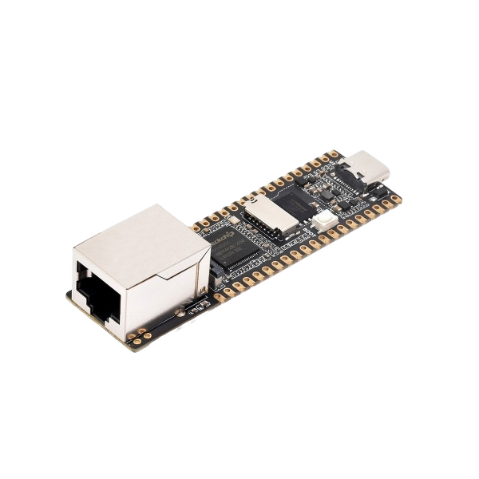
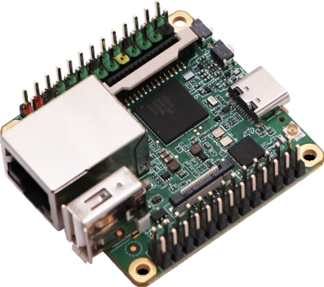
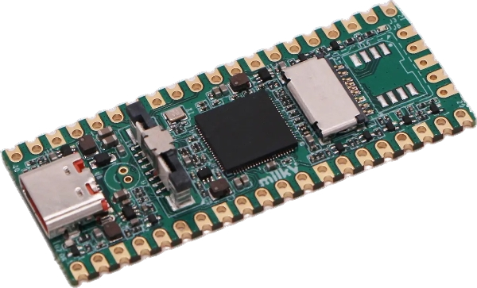

  

  
# Dodo Bot OS
**Dodo Bot OS** is an embedded operating system featuring a built-in **Dodo Bot**.

Created by **LessPlum3393**, Dodo Bot OS provides a modular and extensible platform designed for **embedded hardware, IoT devices, and other connected hardware projects**.

> **Disclaimer:** Dodo Bot OS is an independent project created by **LessPlum3393**. It is **not affiliated with, endorsed by, or associated with** the original **Dodo Bot** created by **dodogames**.

> [!NOTE]
> **All official Dodo Bot OS software, source code, documentation, images, and other content are generated with the assistance of AI.** If you prefer not to use AI-assisted projects, you are free to use an alternative.
>
> This notice does **not** apply to **Community** builds or contributions unless their authors explicitly state that AI was used.

## Features

* 🤖 Built-in Dodo Bot
* ⚡ Lightweight embedded operating system
* 🔌 Modular and extensible architecture
* 🛠️ Designed for embedded hardware, IoT devices, and connected hardware projects

## Downloads

### Standard

Official builds developed and maintained by **LessPlum3393**.

|                          Image                         | Device                                  | Node JS Version | Dodo Bot Version |   OS Version   |      Status     | Username & Password |   Download   |
| :----------------------------------------------------: | --------------------------------------- | :----------: | :----------: | :----------: | :-------------: | :----------: | :----------: |
|     | **Luckfox Pico Plus (Rockchip RV1103)** | v22.23.0 (LTS) | v3.0.4 |    v1.0.0    |    :green_circle: Stable | Username: root   Password: luckfox   | [Download](https://github.com/DodoBotOS/Luckfox-Pico-Plus/releases/download/1.0.0/Dodo-Bot-OS-v1.0.0-Luckfox-Pico-Plus-RV1103.zip) |
|  | **Milk-V Duo S (SG2000)** | v26.3.1 | v3.0.4 | v1.0.0 | :green_circle: Stable | Username: root   Password: rv | **Coming Soon™** |
|  | **Milk-V Duo 256M (SG2002)** | **Coming Soon™** | **Coming Soon™** | **Coming Soon™** | **Coming Soon™** | **Coming Soon™** | **Coming Soon™** |

### Community

Community-maintained builds created by other developers for supported hardware.

**Coming Soon™**

> **Release Policy:** Dodo Bot OS is released on a per-device basis. Each hardware platform has its own release cycle, version history, and feature set. Version numbers are specific to each device and may differ between hardware. Even if two devices share the same version number (e.g. **v1.0.0**), they may include different features, drivers, and capabilities based on the hardware they support.

### Hardware Status

| Status              | Meaning                                                                                                                                                                                                                        |
| ------------------- | ------------------------------------------------------------------------------------------------------------------------------------------------------------------------------------------------------------------------------ |
| 🟢 **Stable**       | Fully supported and recommended. Dodo Bot OS runs reliably with all major features working as expected.                                                                                                                        |
| 🟡 **Experimental** | Supported, but some features may not work correctly. Stability issues, crashes, or hardware limitations may occur. Not recommended for daily use. This status may also be used for hardware that the maintainer does not own, so the build has not been fully tested on physical hardware.                                                                          |
| 🔴 **Discontinued** | Development for this hardware has ended due to hardware limitations or unsupported capabilities. Existing releases remain available, but no further updates will be provided. Functionality may vary depending on the version. |

## License

Dodo Bot OS is licensed under the **GNU General Public License v3.0 (GPL-3.0)**.

You are free to use, modify, and distribute this software under the terms of the GPL-3.0 license. Any distributed modified versions must also be licensed under GPL-3.0, with their source code made available.
